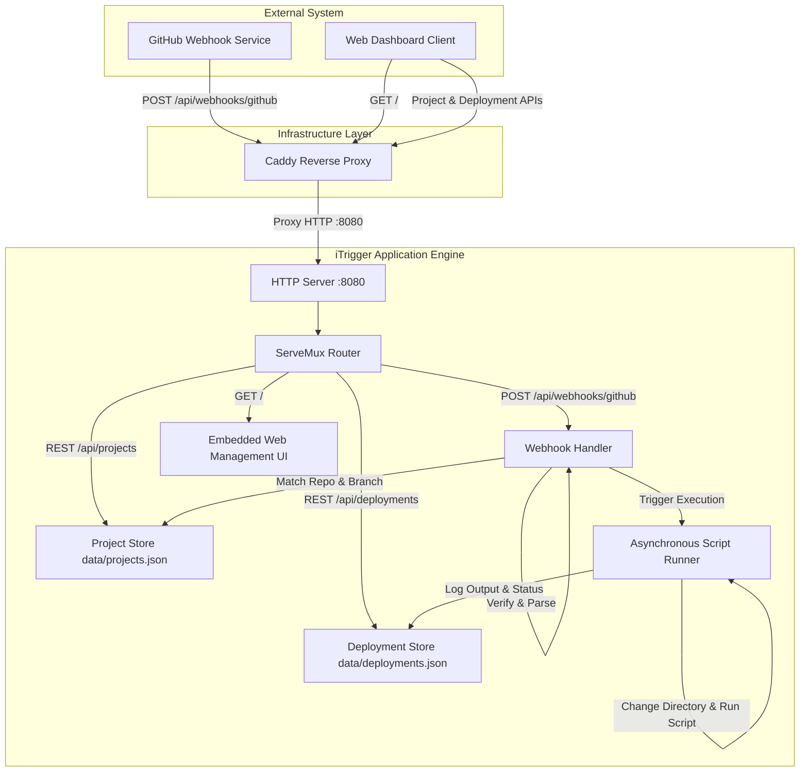
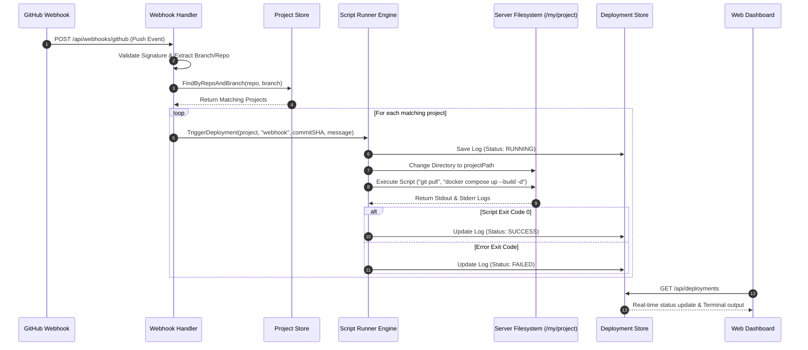

# iTrigger - System & Execution Workflow

This document details the end-to-end operational workflow of **iTrigger**, a lightweight Go-based deployment automation and GitHub webhook management server.

---

## 1. System Architecture Overview



---

## 2. Server Startup & Initialization Workflow

1. **Environment Setup**:
   - [cmd/server/main.go](file:///e:/Projects/trigger-deploying/cmd/server/main.go) loads environment variables using `godotenv`.
   - Verifies presence of `GITHUB_WEBHOOK_SECRET`.
2. **Persistence & Stores Initialization**:
   - `ProjectStore` loads project configurations from `data/projects.json` ([internal/store/project_store.go](file:///e:/Projects/trigger-deploying/internal/store/project_store.go)).
   - `DeploymentStore` loads execution logs from `data/deployments.json` ([internal/store/deployment_store.go](file:///e:/Projects/trigger-deploying/internal/store/deployment_store.go)).
   - `Runner` initializes script execution runner ([internal/deployer/runner.go](file:///e:/Projects/trigger-deploying/internal/deployer/runner.go)).
3. **Route Registration**:
   - Maps API routes in [internal/routes/routes.go](file:///e:/Projects/trigger-deploying/internal/routes/routes.go):
     - `/health` & `/healthz`: Health status.
     - `/api/webhooks/github`: Webhook ingestion.
     - `/api/projects`: List / Create projects.
     - `/api/projects/{id}`: Edit / Delete project.
     - `/api/projects/{id}/deploy`: Manual deployment trigger.
     - `/api/deployments`: Fetch deployment history logs.
     - `/api/deployments/{id}`: Detailed console log view.
     - `/`: Embedded single-page Web Management UI.

---

## 3. Automated Project Deployment Workflow



---

## 4. UI Management & Manual Trigger Workflow

1. **Project Setup**:
   - User opens the **Projects** tab in the dashboard and clicks **Add Project**.
   - Fills in repository (`owner/repo`), branch (`main`), server directory path (`/my/project`), and deployment commands:
     ```bash
     cd /my/project
     git pull origin main
     docker compose down
     docker compose up --build -d
     ```
   - Saved to `data/projects.json`.
2. **Manual Deployment**:
   - User clicks **Deploy Now** on any project card.
   - Front-end sends `POST /api/projects/{id}/deploy`.
   - The runner executes the script immediately in the background.
   - The UI automatically opens the **Terminal Console Viewer** to display output.
