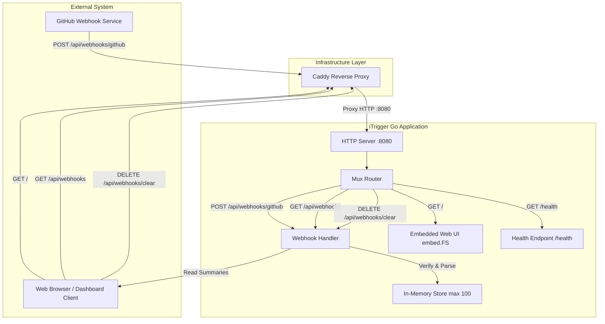
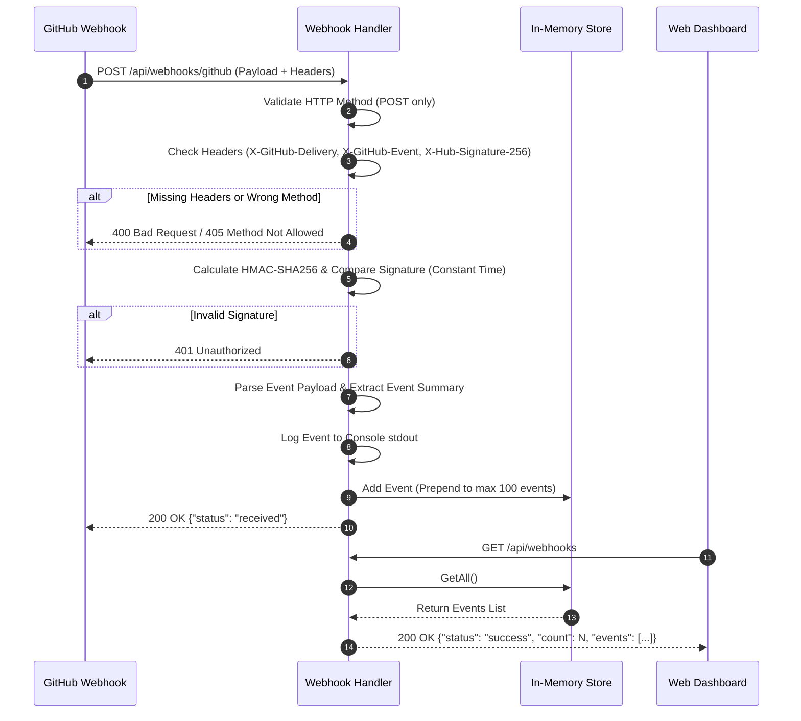
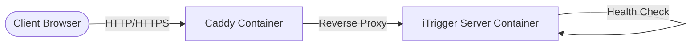

# iTrigger - System & Execution Workflow

This document details the current end-to-end operational workflow of **iTrigger**, a lightweight Go-based deployment and GitHub webhook handling server.

---

## 1. System Architecture Overview

---

## 2. Server Startup Workflow

1. **Environment Setup**:
   - [cmd/server/main.go](file:///e:/Projects/trigger-deploying/cmd/server/main.go) loads environment variables using `godotenv`.
   - Verifies the presence of `GITHUB_WEBHOOK_SECRET`. If missing, the server halts execution.
2. **Server Initialization**:
   - `server.New(secret)` initializes an in-memory thread-safe `webhook.Store` ([internal/webhook/store.go](file:///e:/Projects/trigger-deploying/internal/webhook/store.go)).
   - Registers route handlers in Go `http.ServeMux` ([internal/server/server.go](file:///e:/Projects/trigger-deploying/internal/server/server.go)):
     - `/health` & `/healthz` -> Health check handler
     - `/api/webhooks/github` -> GitHub Webhook POST handler
     - `/api/webhooks` -> Fetch stored events GET handler
     - `/api/webhooks/clear` -> Clear stored events POST/DELETE handler
     - `/` -> Embedded static file server (`web/index.html`, `app.js`, `style.css`)
3. **Execution**:
   - Binds to port `:8080` and begins listening for HTTP requests.

---

## 3. GitHub Webhook Ingestion & Processing Workflow

When GitHub fires an event (e.g., `push` or `pull_request`):

### Detailed Ingestion Steps:
1. **Header Validation**:
   - Requires `X-GitHub-Delivery`, `X-GitHub-Event`, and `X-Hub-Signature-256`.
2. **Security Verification**:
   - Generates an HMAC-SHA256 digest using `GITHUB_WEBHOOK_SECRET` and request body.
   - Performs constant-time comparison (`subtle.ConstantTimeCompare`) against the `X-Hub-Signature-256` header.
3. **Summary Extraction**:
   - Parses generic fields: Delivery ID, Event Type, Repository Name, Action, Sender Login, Timestamps.
   - Extracts event-specific data:
     - **Push**: `Ref` (branch name), commit ID, commit message.
     - **Pull Request**: PR number, PR title.
4. **Storage & Logging**:
   - Formats a structured log message to standard output.
   - Prepends the event to the in-memory circular slice in `webhook.Store` ( capped at 100 items).

---

## 4. In-Memory Event Storage Workflow

- **Thread-Safety**: Managed via `sync.RWMutex` ([internal/webhook/store.go](file:///e:/Projects/trigger-deploying/internal/webhook/store.go)).
- **Cap Enforcement**:
  - Newest events are prepended to `events`.
  - When length exceeds `100`, older events beyond index 100 are trimmed (`events[:100]`).
- **Data Operations**:
  - `Add(event)`: Mutex Write Lock -> Prepend event -> Enforce max limit.
  - `GetAll()`: Mutex Read Lock -> Copy slice -> Return slice.
  - `Clear()`: Mutex Write Lock -> Reset slice to empty.

---

## 5. Web UI & Client Monitoring Workflow

1. **Dashboard Loading**:
   - User navigates to `/`. The server returns static web assets embedded via Go's `embed.FS`.
2. **Fetching Webhook Data**:
   - Frontend (`app.js`) sends a `GET` request to `/api/webhooks`.
   - Server responds with stored webhook summaries.
   - The UI renders delivery items in a list showing delivery ID, event type, repository name, sender, and timestamp.
3. **Clearing History**:
   - User clicks the clear button in the UI.
   - Frontend sends `DELETE` / `POST` request to `/api/webhooks/clear`.
   - Store resets event slice, and UI updates to empty state.

---

## 6. Deployment & Reverse Proxy Workflow

1. **Container Build**:
   - Multi-stage Dockerfile ([Dockerfile](file:///e:/Projects/trigger-deploying/Dockerfile)):
     - **Builder stage**: `golang:1.26-alpine` compiles `cmd/server` into a static binary.
     - **Final stage**: `alpine:latest` runs the lightweight binary.
2. **Orchestration & Reverse Proxy**:
   - Docker Compose ([docker-compose.yml](file:///e:/Projects/trigger-deploying/docker-compose.yml)) launches `server` container and `caddy` reverse proxy.
   - Caddy container handles HTTP/HTTPS proxying based on [Caddyfile](file:///e:/Projects/trigger-deploying/Caddyfile) routing traffic to `itrigger-server:8080`.
   - Healthcheck polls `http://localhost:8080/health` every 10 seconds.
